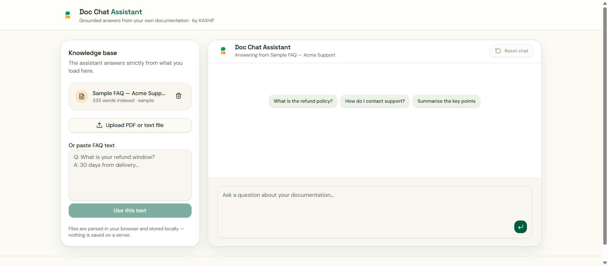

<p align="center">
  
</p>

<h1 align="center">📄 Doc Chat Assistant</h1>

<p align="center">
  Ask questions and get grounded, cited answers from your own documents — your files never leave your browser.
  <br/>
  <a href="https://doc-chat-assistant-main.vercel.app"><strong>Live demo →</strong></a>
</p>

<p align="center">
  
  
  
  
  
  
</p>

## The problem this solves

Answers live buried inside long PDFs, handbooks, and support docs — and support teams retype the same answers every day. Generic chatbots hallucinate when they don't know, and most "chat with your PDF" tools upload your documents to a third-party server, which is a non-starter for confidential material. Doc Chat Assistant answers **strictly from the document you load**, cites the exact sections it used, and parses everything in the browser so your file never leaves your machine.

## Tech stack

- **Framework:** React 19 + TanStack Start (SSR, server functions) + TanStack Router/Query
- **AI:** Vercel AI SDK v7 streaming with Google Gemini (OpenAI-compatible endpoint)
- **Document parsing:** PDF.js (client-side, in the browser)
- **Retrieval:** dependency-free keyword-overlap scoring over chunked text (900-char chunks, 150-char overlap)
- **Persistence:** localStorage (document + conversation)
- **Deployment:** Vercel (Nitro preset)

## Key features

- **Privacy by design** — PDFs are parsed in the browser and stored in localStorage; only plain text is sent to the model, never uploaded to a server
- **Grounded, cited answers** — a strict grounding prompt forces the model to answer only from retrieved excerpts, with `[#n]` citations to the source chunks
- **Streaming chat** — token-by-token responses with suggestion chips to get started
- **Upload PDF/txt/md or paste FAQ text** — with word-count feedback and a one-click reset
- **Explainable retrieval** — a simple, transparent scoring pipeline (no black-box vector DB) that's easy to reason about and extend

## How to run locally

```sh
git clone https://github.com/MK-OmniCode/doc-chat-assistant.git
cd doc-chat-assistant
npm install
npm run dev
```

Requires a `GEMINI_API_KEY`:

```sh
# .env.local
GEMINI_API_KEY=your_key_here
```

For production on Vercel, add `GEMINI_API_KEY` to your project's environment variables.

## What I'd improve next

- **Real embeddings** — keyword-overlap retrieval is fast and transparent but misses synonyms; swapping in embeddings (even client-side hashing or a server-side vector store) would meaningfully lift answer quality
- **Wire up the offline fallback** — there's a zero-config local answer engine (`local-answer.ts`) that's implemented but never called; it should kick in when no API key is set
- **Multiple documents** — currently one knowledge base at a time; multi-doc workspaces with per-doc citations is the natural next step
- **Tests + CI** — the retrieval scoring is pure, deterministic logic and has zero coverage today

---

Built by [Kashif](https://github.com/MK-OmniCode).
